export { default as theme } from './theme'
import { Split, SplitRight } from 'mdx-deck/layouts'
import { Image, Appear } from 'mdx-deck'

# Visualizing the Decentralized Web
---
# Jim Pick

Vancouver, Canada
---
# Open Source

Starting in 1990s...

* Debian
* Linux Kernel
* Open Source Java
---
# Career

* Mix of startups and consulting
* California and Canada
* Client work: many websites and apps
---
# Joyent

2009-2011

* Ryan Dahl *(creator of Node.js)*
* Isaac Schlueter *(creator of npm)*
---
<Image src='images/nihon-2010.jpg' size='contain'/>
---
# Freelancing

2017-2018

Focus on "decentralized web"
---
# Client Projects

2018
---
export default SplitRight


## Ink & Switch

* San Francisco
* original founders of Heroku
---
export default SplitRight


## Ink & Switch

Martin Kleppman, University of Cambridge

O'Reilly - Designing Data-Intensive Applications

Automerge CRDT
---
export default SplitRight

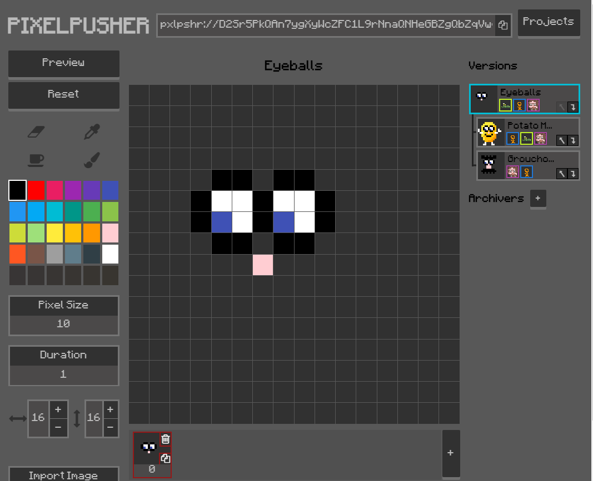

## Ink & Switch

**PixelPusher**

* pixel art editor
* collaborative
* Dat + Automerge CRDT
---
export default SplitRight


## Dat Project

(with @mafintosh)

* Demo: Dat Shopping List
* "multiwriter" command line
---
export default SplitRight

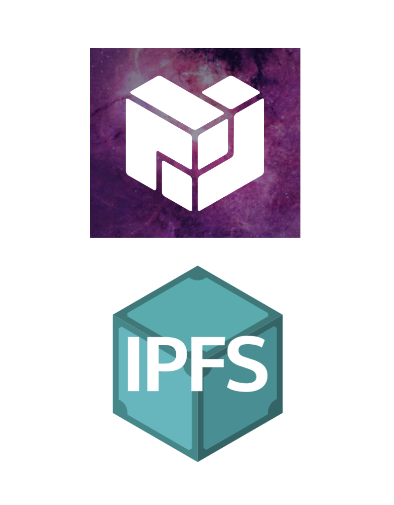

# Protocol Labs

 * IPFS
 * "Dynamic Data"
 * peerpad.net
 * Delta CRDTs
---
# Visualizations

<ul style={{textAlign: 'left'}}>
  <Appear>
    <li>Web 1998</li>
    <li>Web 2018</li>
    <li>WebTorrent</li>
    <li>Dat</li>
    <li>IPFS</li>
  </Appear>
</ul>

---
export default SplitRight


# Web Publishing

Let's publish this GIF...

# ➡
---
export default SplitRight

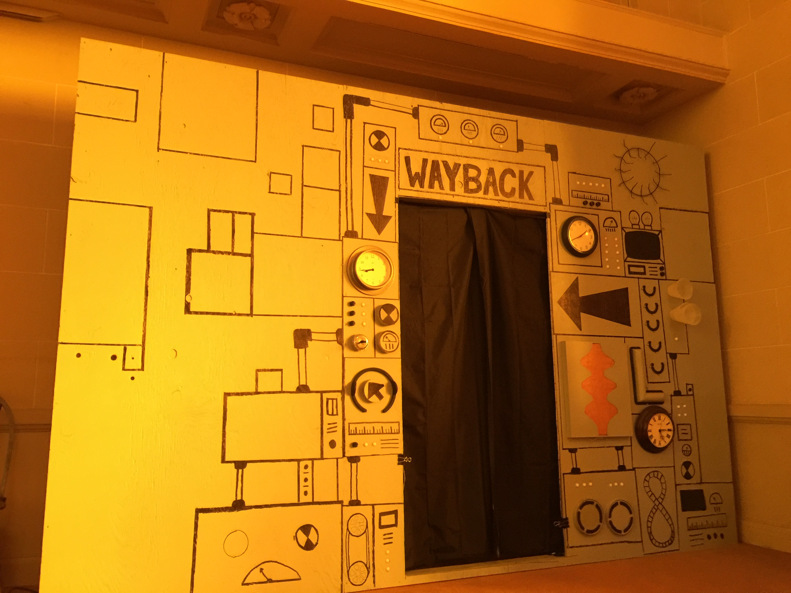

# Web 1998

Let's go back in time...
---
export default SplitRight

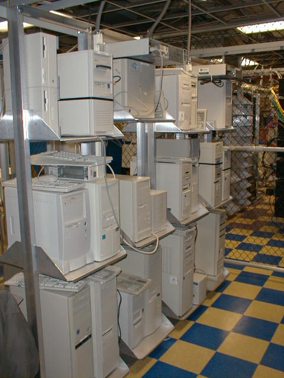

# Web 1998

* Physical hardware
---
export default SplitRight

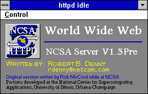

# Web 1998

* Physical hardware
* NCSA httpd
---
export default SplitRight

```
<html>
  <head><title>Sheldon</title><head>
  <body>
  <h1>My Dog</h1>
  
</html>
```

# Web 1998

* Physical hardware
* NCSA httpd
* HTML
---
export default SplitRight

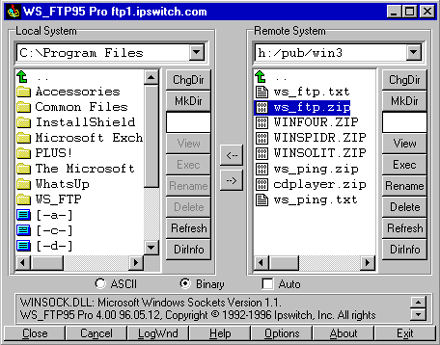

# Web 1998

* Physical hardware
* NCSA httpd
* HTML
* FTP
---
export default SplitRight

<video src='images/netscape.mp4' controls style={{width: '100%'}} />

# Web 1998

* Physical hardware
* NCSA httpd
* HTML
* FTP
* Netscape
---
## Web 1998 Traceroute

<video src='images/traceroute-no-cdn.mp4' controls style={{width: '100%'}} />
---
# Web 2018
---
export default SplitRight

```
<html>
  <head><title>Sheldon</title><head>
  <body>
  <h1>My Dog</h1>
  
</html>
```

# Web 2018

HTML is the same!
---
# Web 2018

What has changed?

<ul style={{textAlign: 'left'}}>
  <Appear>
    <li>Cloud Services (eg. AWS, Azure)</li>
    <li>CDNs (Akamai, Cloudflare, CloudFront)</li>
    <li>Chrome, Safari, Edge, Firefox</li>
    <li>SSL, Let's Encrypt</li>
  </Appear>
</ul>
---
# CDN

CDN = Content Distribution Network

"The Edge"
---
## CDN


---
## CDN

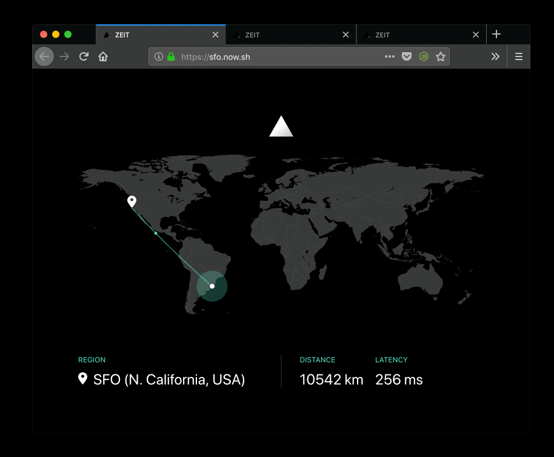
---
## Web 2018 Traceroute (CDN)

<video src='images/traceroute-cdn.mp4' controls style={{width: '100%'}} />
---
# Web 2018

[https://sheldon-cdn.jimpick.com/](https://sheldon-cdn.jimpick.com/)
---
# WebTorrent

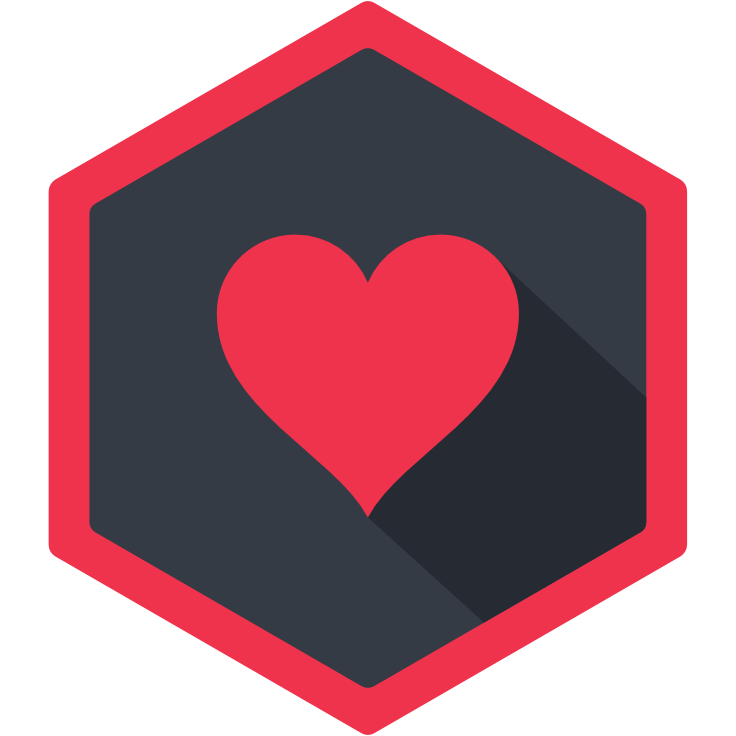
---
# WebTorrent

Based on BitTorrent

[Visualization](http://mg8.org/processing/bt.html)
---
<a href="https://webtorrent.io/">https://webtorrent.io/</a>
---
# WebTorrent

Works on the web, based on WebRTC


---
<!-- Dat -->

---
# Dat

<ul style={{textAlign: 'left'}}>
  <Appear>
    <li>designed for sharing science data</li>
    <li>non-profit</li>
    <li>similar to BitTorrent</li>
    <li>can update data</li>
  </Appear>
</ul>
---
# Neuroscience

"Schwann cell‐specific deletion of the endosomal
PI 3‐kinase Vps34 leads to delayed radial sorting of
axons, arrested myelination, and abnormal ErbB2‐ErbB3
tyrosine kinase signaling"
---
### Beaker Browser

<video src='images/beaker-science.mp4' controls style={{width: '90%'}} />
---
### Dat Swarm

<video src='images/dat-swarm.mp4' controls style={{width: '70%'}} />
---
### Dat for Data Preservation

Institutions can work together

* California Digital Library
* Internet Archive
* Dat Project
---
<!-- IPFS -->
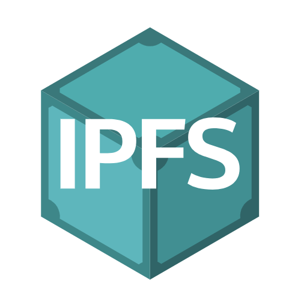
---
# IPFS

<ul style={{textAlign: 'left'}}>
  <Appear>
    <li>content addressability</li>
    <li>de-duplication</li>
    <li>Protocol Labs</li>
  </Appear>
</ul>
---
## Secure Scuttlebutt
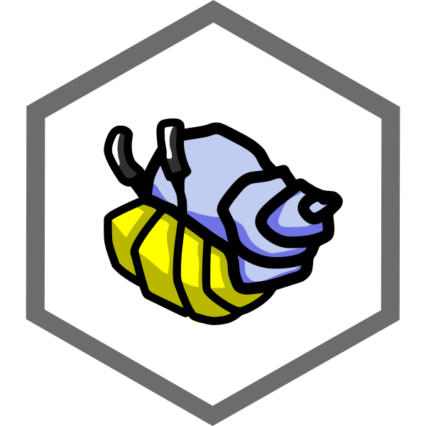
---
## Secure Scuttlebutt
<ul style={{textAlign: 'left'}}>
  <Appear>
    <li>social network</li>
    <li>each person has an append-only feed</li>
    <li>works offline</li>
    <li>"pubs"</li>
  </Appear>
</ul>
---
## Patchwork
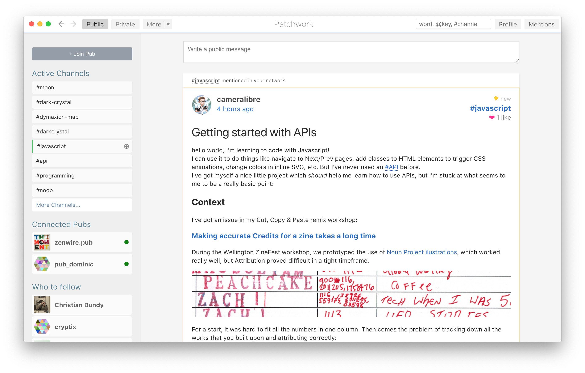
---
export default SplitRight

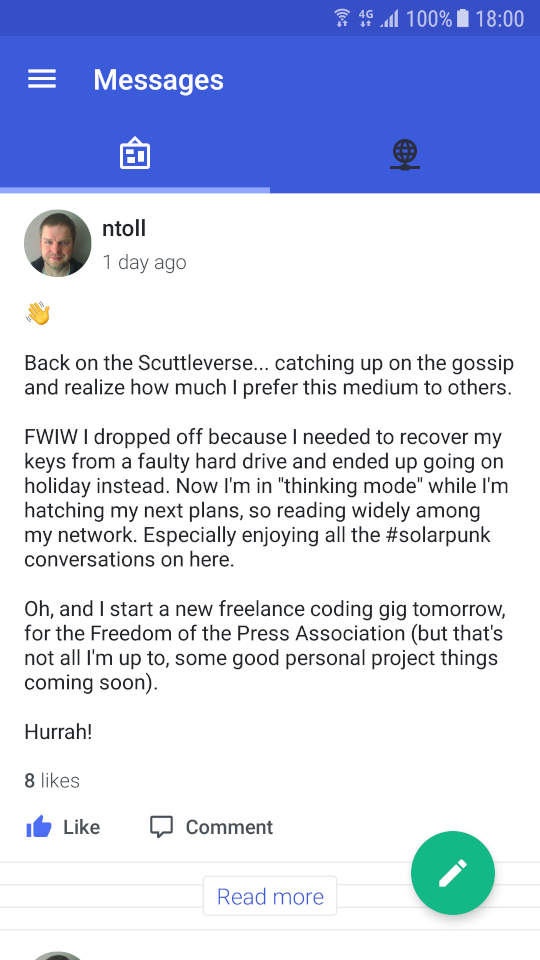

## Manyverse

Android
---
# 終

It is still early days for the decentralized web.

Try it out!
---
# ありがとう！！

@jimpick


